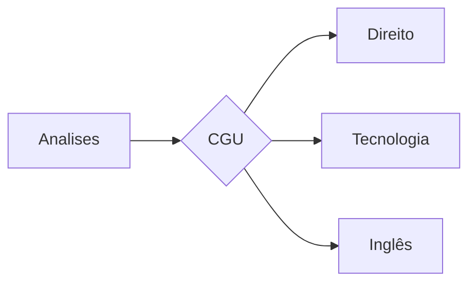

# Controladoria Geral da União - CGU

### EDITAL:

<ul>
  
  <li>
    <p><b><code> BANCA </code></b></p>
    <p><i> FGV:  </i></p>
  </li>
  
  <li>
    <p><b><code> CONTEUDO </code></b></p>
    <p><i> DIREITO </i></p>
    <p><i> TECNOLOGIA DA INFORMAÇÃO </i></p>
    <p><i> INGLêS </i></p>
  </li> 
  
  <li>
    <p><b><code> CRONOGRAMA </code></b></p>
    <p><i>  </i></p>
  </li>
  
</ul>

### COMANDOS

```
B[Analises]

B --> C{Concursos}
C --> J[Banca]
C --> K[Edital]
C --> L[Conteudo]
C --> O[Provas anteriores]
C --> M[Revisoes]
C --> N[Simulados]
```


### FLUXOGRAMA/DIAGRAMA



### FONTE:


### 1.0 - FASES DO PROJETO

```
<ul>
  
  <li>
    <p><b><code>1.1 - [VIRTUAL ENV] </code></b></p>
    <p><i> Instrução:  </i></p>
  </li>
  
  <li>
    <p><b><code>1.2 - [FRONT-END] </code></b></p>
    <p><i> Fase-1: https://www.youtube.com/watch?v=wCOInE7-E0I  </i></p>
  </li> 
  
  <li>
    <p><b><code>1.3 - [BACK-END] </code></b></p>
    <p><i>  </i></p>
  </li>
  
</ul>
```

<ul>
  
  <li>
    <p><b><code>1.1 - [VIRTUAL ENV] </code></b></p>
    <p><i> Instrução:  </i></p>
  </li>
  
  <li>
    <p><b><code>1.2 - [FRONT-END] </code></b></p>
    <p><i> Fase-1: https://www.youtube.com/watch?v=wCOInE7-E0I  </i></p>
  </li> 
  
  <li>
    <p><b><code>1.3 - [BACK-END] </code></b></p>
    <p><i>  </i></p>
  </li>
  
</ul>

